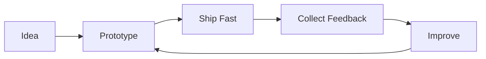

````md
<!-- Hero -->

<p align="center">
  
</p>

<h1 align="center">Hi, I'm Manoj 👋</h1>

<p align="center">
Computer Science Engineering Student • AI Builder • Startup Founder
</p>

<p align="center">
Building products that solve real problems.
</p>

---

# 🚀 Current Focus

- 🧠 Building **Rehai**, an AI-powered neurorehabilitation platform
- ⚡ Building **Hytrax**, a local-first memory layer for AI coding agents
- 🎨 Growing **Rarestar Studio**
- 📚 Exploring LLMs, AI Systems and Developer Tools

---

# 🗺️ What I'm Building

```mermaid
mindmap
  root((Manoj))
    AI
      Rehai
      Enterprise Knowledge Hub
    Developer Tools
      Hytrax
    Products
      UNIT-X
    Startup
      Rarestar Studio
````

---

# 📦 Latest Projects

| Project                         | Description                                                |
| ------------------------------- | ---------------------------------------------------------- |
| 🧠 **Rehai**                    | AI-powered speech & cognitive neurorehabilitation platform |
| ⚡ **Hytrax**                    | Local-first memory for AI coding agents                    |
| 🏢 **Enterprise Knowledge Hub** | Enterprise document intelligence system                    |
| 🎨 **Rarestar Studio**          | Design & software studio                                   |
| 📱 **UNIT-X**                   | Flutter productivity & timetable app                       |

---

# 💻 Tech Stack

```text
Languages
Python • Java • C++ • Dart • JavaScript • TypeScript

Frontend
React • Next.js • Flutter • HTML • CSS • Tailwind CSS

Backend
Supabase • PostgreSQL • Node.js

Currently Exploring
LLMs • RAG • LangChain • AI Agents
```

---

# ⚙️ Build Philosophy



---

# 📊 GitHub Stats

<p align="center">


</p>

<p align="center">

</p>

---

# 🐍 Contribution Snake

> Requires the Platane/snk GitHub Action.

<p align="center">

</p>

---

# 🎮 Mini Game

<details>
<summary><b>🐞 Find the Bug</b></summary>

Can you spot the bug?

```cpp
if(name = "Manoj"){
    cout << "Hello!";
}
```

<details>
<summary>Answer</summary>

You used **=** (assignment).

It should be:

```cpp
if(name == "Manoj"){
    cout << "Hello!";
}
```

</details>

</details>

---

# 📈 2026 Goals

* 🚀 Launch Rehai publicly
* 🌍 Release Hytrax as open source
* 💼 Scale Rarestar Studio
* 🤝 Contribute more to open source
* 🧠 Learn something new every week

---

# 📫 Connect

📧 **[manojhv01@gmail.com](mailto:manojhv01@gmail.com)**

---

<p align="center">

*"Build. Ship. Learn. Repeat."*

</p>
```
